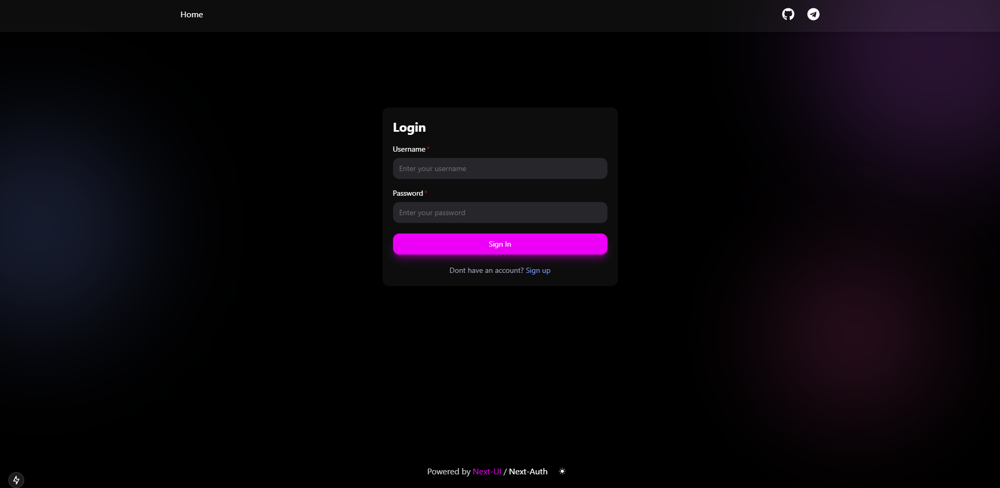

# Next-Auth-Credentials Project

This project is a simple implementation of authentication using **NextAuth.js**, **Next.js**, and **Next UI**. It demonstrates how to set up credential-based authentication in a Next.js application with a beautiful user interface.

## Overview

Below are two screenshots showcasing the login page and a protected page:



## Features
- Credential-based authentication using NextAuth.js.
- Modern and responsive UI built with Next UI.
- Fully customizable and easy-to-understand codebase.

## Prerequisites

Before you begin, ensure you have the following installed on your machine:
- **Node.js** (v16 or later)
- **npm** or **yarn**
- **Git**

## Getting Started

### 1. Clone the Repository
To download the project, run the following command:
```bash
git clone https://github.com/shulgastanslv/next-auth-credentials.git
```

### 2. Navigate to the Project Directory
```bash
cd next-auth-credentials
```

### 3. Install Dependencies
Install the required packages using npm or yarn:
```bash
npm install
# or
yarn install
```

### 4. Set Up Environment Variables
Create a `.env` file in the root directory and add the following variables:
```env
NEXTAUTH_SECRET=your-secret-key
NEXTAUTH_URL=http://localhost:3000
```
You can generate a secret key using this command(Linux):
```bash
openssl rand -base64 32
```

### 5. Start the Development Server
Run the following command to start the application:
```bash
npm run dev
# or
yarn dev
```

Open your browser and navigate to `http://localhost:3000`.

## How It Works

### Authentication Flow
1. **Login Page**: Users enter their credentials (e.g., username and password) on the login/register page page.
2. **NextAuth.js**: The credentials are sent to the NextAuth.js API route for verification.
3. **Session Management**: You will see the session status on the home page `(home)/page.tsx`

### File Structure
```plaintext
next-auth-credentials/
├── app/
│   ├── api/
│   │   └── auth/[...nextauth]/route.ts  # NextAuth.js 
│   ├── auth/
│       ├── login/page.tsx #login page
│       ├── register/page.tsx #register page
│
├── components/*
├── .env.local.[example]  # Example environment file
└── package.json  # Project dependencies and scripts
```

### Key Dependencies
- **[NextAuth.js](https://next-auth.js.org/)**: Handles authentication and session management.
- **[Next.js](https://nextjs.org/)**: Framework for server-side rendering and routing.
- **[Next UI](https://nextui.org/)**: Provides pre-styled components for a beautiful and responsive UI.

## Customization
Feel free to modify the following:
- **Authentication Logic**: Update the `[...nextauth]/route.ts` file to integrate with your own database or API.
- **UI Components**: Customize the components in the `components/` folder to match your design requirements.


## Contribution
If you have suggestions or improvements, feel free to fork the repository and submit a pull request. Contributions are always welcome!


## License
This project is licensed under the [MIT License](LICENSE).


